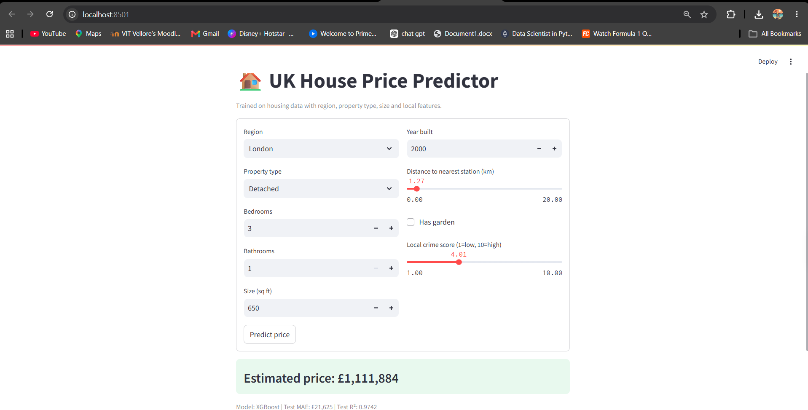

# UK House Price Predictor
🔗 **[Live App](https://uk-house-price-predictor-kwkeeqgzzuwnrcojsk98ip.streamlit.app)** · **[API Docs](https://uk-house-price-predictor.onrender.com/docs)**

A machine learning project that predicts UK house prices based on region, property type, size, and local features. Includes a trained model, a REST API, and a simple web interface.

## What it does

Given details about a property — region, type, bedrooms, size, distance to the nearest station, etc. — the model estimates a price. Two models were trained and compared: a Linear Regression baseline and XGBoost. XGBoost performed noticeably better, so that's what's deployed.

| Model | Validation MAE | Validation R² |
|---|---|---|
| Linear Regression | £31,950 | 0.933 |
| XGBoost | £21,249 | 0.978 |

Held-out test performance: MAE £21,719, R² 0.974.

## Feature engineering notes

- `property_age` is derived from `year_built` — models pick up on "how old" better than an arbitrary year number.
- `sqft_per_bedroom` flags properties that are unusually cramped or spacious for their bedroom count, which raw sqft alone doesn't capture.
- Categorical features (region, property type) are one-hot encoded; numeric features are standardised, both handled inside a single sklearn pipeline so there's no mismatch between training and inference.

## Project structure
uk-house-price-predictor/
data/ (generated dataset, not tracked in git)
src/
generate_data.py (dataset generator)
train.py (feature engineering, training, model comparison)
api/
main.py (FastAPI backend)
app/
streamlit_app.py (frontend)
models/ (trained model, not tracked in git)
requirements.txt
Dockerfile
docs/screenshot.png